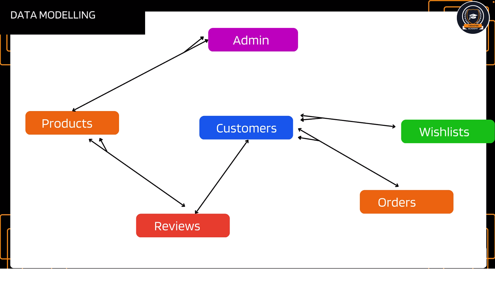

# E-Commerce Website API By Can Comertpay

## Project Data Modelling



- This is my own e-commerce website back-end section.

## Technologies

- This project created by using Node.js, Express.js, MongoDB.

## Cloning

```bash
git clone https://github.com/cancomertpay/e-commerce-site-api
```

## License

[MIT](https://choosealicense.com/licenses/mit/)